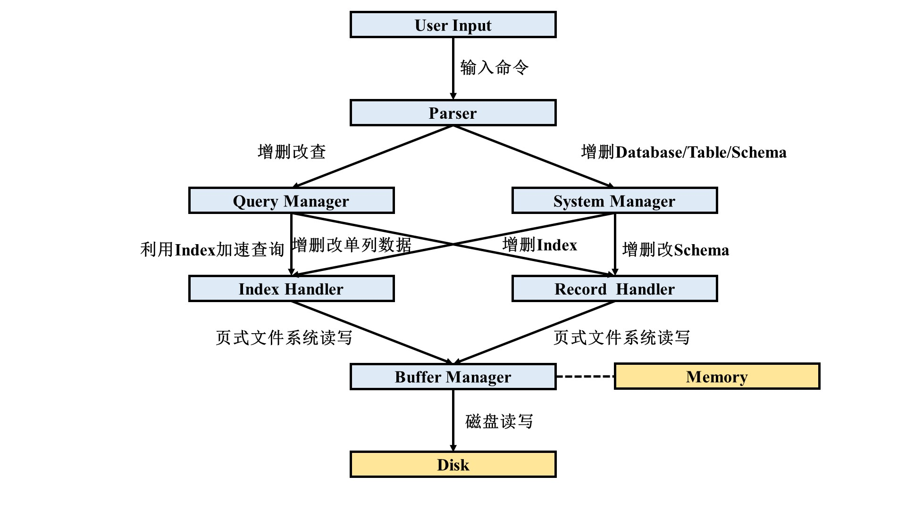

<font face="宋体">

# <center>数据库系统概论中期报告</center>

<center>罗富文 计91 2019011409  任彦羽 计91 2019011215</center>

## 1. 项目运行

### 1.1. 依赖

本项目在 Linux 操作系统下开发和运行，环境依赖为 `cmake` （实验中版本为 `3.5.1` ）。

### 1.2. 运行方法

在项目目录下依次运行如下 bash 命令。项目 README 文件中有更详细的说明。

```sh
mkdir build   # build directory
cd build
cmake ..
make
cd src        # executive name is database2021
```

## 2. 项目功能

### 2.1. 基础功能

 - 基本运行：能交互式输入并解析；执行 SQL 语句；
 - 系统管理：增删 Database ；增删 Table ；增删 Schema ；打印 Database 或 Table 信息；
 - 查询解析：执行查询功能；两表 Join ；查询报错；
 - 完整性约束：增删主外键，包括联合主键和联合外键；增删数据时考虑 Schema 约束；
 - 模式管理：主外键 Schema 增删，包括联合主键和联合外键；
 - 索引模块：索引 Schema 增删；索引加速查询，在百万级别数据下有明显加速。

### 2.2. 选做功能

 - 多表 Join ：两表以上 Join；
 - 聚合查询：可支持 AVG SUM MIN MAX COUNT 等聚集查询模式；
 - 扩展数据类型：实现 Date 类型数据的增删查改；
 - UNIQUE 约束：可增删 UNIQUE 属性；利用索引加速包含 UNIQUE 属性的增删操作；
 - NULL ：插入 NULL 判定；主外键 NULL 判定；处理包含 NULL 的条件表达式；
 - 高级模式管理 ALTER ：可增加或删除指定列；
 - 更多索引：可支持 INT DOUBLE VARCHAR 等各种数据类型的索引。

## 3. 总体架构

本项目共分为 6 个基本模块和 2 个附加模块。介绍如下。

 - 文件系统 Buffer Manager ：由下发的文件系统代码改造而成，可实现基本的页式文件管理，从磁盘读取数据、修改数据、替换数据、向磁盘写入数据等。
 - 记录管理模块 Record Handler ：把上层模块给的二进制数据写入 Slot ，与文件系统交互完成单条记录数据的读取、写入等。
 - 索引模块 Index Handler ：利用 B+ 树基于页式文件系统完成索引管理，与文件系统和记录管理模块交互完成索引的读取、写入等。
 - 系统管理模块 System Manager ：维护 Database 和 Table 等的增删管理，同时提供 Schema 增删改工具，如增删列、增删主外键、增删 UNIQUE 标记、增删索引等。
 - 查询管理模块 Query Manager ：完成数据的增删改查和多表连接等，与系统管理模块交互获取 Database 和 Table 的相关数据和信息。
 - 查询解析模块 Parser ：由下发的 antlr 语法文件经修改后生成，解析用户输入的字符串并调用系统管理模块和查询管理模块获得结果，然后输出。
 - 附加模块 Table ：把记录管理模块输出的有关 Table 的二进制数据转化为结构体 Struct 方便系统管理模块和查询管理模块处理，把上层模块传递的结构体 Struct 转化为二进制数据并用记录管理模块保存。
 - 附加模块 Name Handler ：与 Table 模块类似，但管理的是关于 Database 的信息。

系统结构图如下。



## 4. 各部分实现方法与主要接口

### 4.1. 文件系统 Buffer Manager

该模块由下发的文件系统代码改造而成，采用哈希表结构存储文件页，调用系统文件读写函数完成文件读写，同时向上提供为不同文件分配文件页和存取文件页数据的功能。

该模块主要接口和功能如下（未列出所有函数）。

```c++
class BufManager {
    // 为文件中的某一个页面获取一个缓存中的页面
    BufType allocPage(int fileID, int pageID, int& index, bool ifRead = false);
    // 为文件中的某一个页面在缓存中找到对应的缓存页面
    BufType getPage(int fileID, int pageID, int& index);
    // 标记 index 代表的缓存页面被访问过，为替换算法提供信息
    void access(int index);
    // 标记 index 代表的缓存页面被写过，保证替换算法在执行时能进行必要的写回操作，保证数据的正确性
    void markDirty(int index);
    // 将 index 代表的缓存页面归还给缓存管理器，在归还前，缓存页面中的数据不标记写回
    void release(int index);
    // 将 index 代表的缓存页面归还给缓存管理器，在归还前，缓存页面中的数据需要根据脏页标记决定是否写到对应的文件页面中
    void writeBack(int index);
    // 将所有缓存页面归还给缓存管理器，归还前需要根据脏页标记决定是否写到对应的文件页面中
    void close();
    // 给定文件名，创建文件
    void createFile(const char* filename);
    // 给定文件名，打开文件，返回文件编号
    int openFile(const char* filename);
    // 给定文件编号，关闭文件
    void closeFile(int fd);
    // 给定文件名，删除文件
    void removeFile(const char* filename);
};
```

### 4.2. 记录管理模块 Record Handler

记录管理模块主要用于保存 Table 和 Index 的数据信息。在本大作业中，记录管理采用定长模式，在创建文件时即指定每条记录的长度，此后不再变化。每个文件分为若干页，每页大小为 8 kb ，第 0 页保存该文件的记录长度、记录条数等信息和 Table 的表头，从第 1 页开始，每页被分为若干个长度固定的槽，每个槽保存一条数据，在每页的结尾还有 slotMap 用于记录每个槽是否占用。读取数据时，根据 RID ，即 { PageID, SlotID } 确定要读取的数据的位置，并把相应槽内的二进制数据复制至指定的 buffer 内返回给上层调用者。写数据时，寻找第一个空闲槽，将数据写入该槽中。

空闲槽的位置通过大根堆维护。每次打开文件时，记录管理模块线性扫描所有页，对于有空闲槽的页，记录其编号并将其放入小根堆中。此后，若插入、删除记录或新增页，则动态维护小根堆中的数据。需要查找空闲槽时，从小根堆中取第一个有空闲槽的页编号，然后扫描 slotMap ，寻找第一个空闲槽即可。

该模块主要接口和功能如下（未列出所有函数）。

```c++
class RecordHandler {
    // 给定文件名，创建文件
    int createFile(string fileName);
    // 给定文件名，删除文件
    int destroyFile(string fileName);
    // 给定文件名，打开文件
    int openFile(string fileName);
    // 关闭已打开的文件
    int closeFile();
    // 写 Table 的表头，表头保存在第 0 页
    int readHeader(char *pData);
    // 读 Table 的表头
    int writeHeader(char *pData);  
    // 给定 PageID 和 SlotID 读取记录，结果保存在 pData 中
    int getRecord(const RID &rid, char *&pData);
    // 给定 RID ，删除记录
    int deleteRecord(const RID &rid);
    // 插入记录 pData ，返回插入的位置
    RID insertRecord(const char *pData, int len = MAX_RECORD_LEN);
    // 给定 PageID 和 SlotID ，将该位置的记录更新为 pData
    RID updateRecord(const RID &rid, const char *pData, int len = MAX_RECORD_LEN);
    // 获得该文件中的所有记录，以 RID 列表的形式呈现
    vector <RID> getRecordList();
};
```

### 4.3. 索引模块 Index Handler

索引管理模块内部维护了一个 B+ 树。为使得索引能够适应无 UNIQUE 约束， B+ 树中还有一类 Overflow 节点，用于存储同一键值的不同节点信息。该模块中，键值使用记录管理模块储存，因而具有较好的变长存储拓展性。

该模块主要接口和功能如下（未列出所有函数）。

```c++
class IndexHandler{
    // 创建 IndexHandler 时自动生成或者打开文件
    IndexHandler(std::string tableName, std::string colName, DataType type);
	// 插入键值对 ( key, rid )
    void insert(key_ptr key, RID rid);
    // 移除键值对 ( key, rid )
    void remove(key_ptr key, RID rid);
    // 查询是否有包含键 key 的键值对
    bool has(key_ptr key);
    // 查询键值等于 key 的键值对个数
    int count(key_ptr key);
    // 查询键值小于 key 的键值对个数
    int lesserCount(key_ptr key);
    // 查询键值大于 key 的键值对个数
    int greaterCount(key_ptr key);
    // 获得 B+ 树第一个叶子节点上第一个键值对的迭代器
    IndexScan begin();
    // 获得恰好小于等于 key 的键值对的迭代器
    IndexScan lowerBound(key_ptr key);
    // 获得恰好大于等于 key 的键值对的迭代器
    IndexScan upperBound(key_ptr key);
    // 获得恰好小于 key 的键值对的迭代器
    IndexScan lesserBound(key_ptr key);
    // 获得恰好大于 key 的键值对的迭代器
    IndexScan greaterBound(key_ptr key);
    // 获得所有键值等于 key 的键值对对应的记录的位置
    std::vector<RID> getRIDs(key_ptr key);
    // 获得键值对数量
    inline int totalCount();
    // 关闭索引文件
    void closeIndex();
    // 删除索引文件
    void removeIndex();
}
```

### 4.4. 系统管理模块 System Manager

系统管理模块主要执行与建立/删除 Database 、建立/删除 Table 、增加/删除 Schema 相关的功能，同时记录当前所在 Database 和 Table 信息，供查询管理模块使用。

该模块主要接口和功能如下（未列出所有函数）。

```c++
class SystemManager {
    // 获取所有 Database 的名字信息，以 string 列表的形式呈现
    int getDbNameList(vector <string>& nameList);
    // 给定 Database 名称，建立数据库
    int createDb(string dbName);
    // 给定 Database 名称，删除数据库
    int dropDb(string dbName);
    // 给定 Database 名称，打开数据库
    int openDb(string dbName);
    // 关闭已打开的数据库
    int closeDb();
    // 获取当前所在的 Database 的名称
    string getDbName();
    // 获取当前所在的 Database 的所有 Table 名称
    int getTableNameList(vector <string>& nameList);
    // 给定 Table 名称和表头，建立表
    int createTable(string tableName, vector <TableHeader> headerList);
    // 给定 Table 名称，删除表
    int dropTable(string tableName);
    // 给定 Table 名称，判断该表在当前所在的 Database 中是否存在
    bool hasTable(string tableName);
    // 给定 Table 名称，获取该 Table 类的指针， Table 类在 4.7 节有详细说明
    Table *getTable(string tableName);
    // 给定 Table 名称，获取该表的表头信息，以 string 列表的形式呈现
    int getHeaderList(string tableName, vector <TableHeader>& headerList);
    // 给定 Table 名称和表头，建立索引
    int createIndex(string tableName, string headerName);
    // 给定 Table 名称和表头，删除索引
    int dropIndex(string tableName, string headerName);
    // 给定 Table 名称和表头，新增列，表中已有的数据新增列数据为 defaultData
    int createColumn(string tableName, TableHeader header, Data defaultData);
    // 给定 Table 名称和表头，删除列
    int dropColumn(string tableName, string headerName);
    // 给定 Table 名称和表头列表，建立主键（包括联合主键）
    int createPrimary(string tableName, vector <string> headerNameList);
    // 给定 Table 名称和表头列表，删除主键（包括联合主键）
    int dropPrimary(string tableName, vector <string> headerNameList);
    // 给定 Table 和 foreignTable 名称，并利用 TableHeader 指定引用关系，新增外键（包括联合外键）
    int createForeign(string tableName, string foreignTableName, vector <TableHeader> updateHeaderList);
    // 给定 Table 名称和表头列表，删除外键（包括联合外键）
    int dropForeign(string tableName, vector <string> headerNameList);
    // 给定 Table 名称和表头列表，新增 UNIQUE 属性
    int createUnique(string tableName, vector <string> headerNameList);
    // 给定 Table 名称和表头列表，删除 UNIQUE 属性
    int dropUnique(string tableName, vector <string> headerNameList);
};
```

### 4.5. 查询管理模块 Query Manager

查询管理模块主要执行数据的增删改查操作。插入操作直接调用 Table 类的相应函数插入数据；删除和更新操作采用全表遍历的方法，遍历所有数据并筛选符合条件的数据进行相应操作。查询操作集成了单表查询、多表连接、聚集查询等功能，运行机制相对复杂，下面将详细说明。

首先，对每一张表中的数据进行初步筛选，若某些条件所指定的列带有索引，则尝试使用索引加速筛选，否则遍历表中的所有元素，利用条件列表中仅涉及该表的条件进行筛选，筛选结果以 RID 列表的形式呈现。接下来，对各表筛选出的数据进行拼接，并利用条件列表中剩余的涉及多表的条件进行筛选，若为非聚集查询则返回查询结果，若为聚集查询则统计查询结果的相应信息并返回。

该模块主要接口和功能如下（未列出所有函数）。

```c++
class QueryManager {
    // 给定 Table 名称列表和需要的数据信息（在 selectorList 中给出，每三个元素分别为 tableName headerName aggregator ）
    // 返回符合筛选条件列表 conditionList 的数据，结果保存在 resData 中， aggregation 用于标记是否为聚集查询
    int exeSelect(vector <string> tableNameList, vector <pair <pair <string, string>, string> > selectorList,
        vector <Condition> conditionList, bool aggregation, vector <vector <Data> >& resData);
    // 向名为 tableName 的表中插入一条数据 dataList
    int exeInsert(string tableName, vector <Data> dataList);
    // 给定 Table 名称，删除符合筛选条件列表 conditionList 的数据
    int exeDelete(string tableName, vector <Condition> conditionList);
    // 给定 Table 名称，更新符合筛选条件列表 conditionList 的数据，修改规则为将 updateHeaderNameList 中的每列数据修改为 updateDataList 中对应列的数据
    int exeUpdate(string tableName, vector <string> updateHeaderNameList, vector <Data> updateDataList, vector <Condition> conditionList);
};
```

### 4.6. 查询解析模块 Parser

#### TODO

### 4.7. 附加模块 Table

为了代码编写方便，我们在记录管理模块和系统管理/查询管理模块之间增加了 Table 模块。该模块的主要作用是管理指定 Table ，把数据在上层模块方便处理的数据结构表示和底层的二进制表示之间转换。

该模块主要接口和功能如下（未列出所有函数）。

```c++
class Table {
    // 给定 Database 和 Table 名称，打开表
    Table(string dbName, string tableName, RecordHandler *recordHandler);
    // 给定 Database 和 Table 名称，给定表头，建立表
    Table(string dbName, string tableName, BufManager *bufManager, vector <TableHeader> headerList);
    // 获取打开或建立的表的名称
    string getTableName();
    // 获取该表格表头
    vector <TableHeader> getHeaderList();
    // 修改该表格表头
    int writeHeaderList(vector <TableHeader> headerList);
    // 给定 RID ，从表格中读取数据
    vector <Data> exeSelect(RID rid);
    // 向表格中插入一行数据，返回插入的位置
    RID exeInsert(vector <Data> data);
    // 给定 RID ，从表格中删除数据
    int exeDelete(RID rid);
    // 给定 RID ，更新表格中的数据，返回更新后数据的位置
    RID exeUpdate(vector <Data> data, RID rid);
    // 获得该表中的所有数据，以 RID 列表的形式呈现
    vector <RID> getRecordList();
};
```

### 4.8. 附加模块 Name Handler

与 Table 模块类似，但 Name Handler 模块的主要作用是管理 Database 相关的信息（ Database 名称和 Database 内的 Table 名称）。

该模块主要接口和功能如下（未列出所有函数）。

```c++
class NameHandler {
    // 建立或打开 Database 名称管理器
    NameHandler(BufManager *bufManager);
    // 给定 Database 名称，建立或打开 Table 名称管理器
    NameHandler(BufManager *bufManager, string dbName);
    // 获取所有 Database 或指定 Database 中所有 Table 名称的列表
    vector <string> getElementList();
    // 给定 Database 或 Table 名称，查询其是否存在
    bool hasElement(string elementName);
    // 新增 Database 或 Table
    int createElement(string elementName);
    // 删除 Database 或 Table
    int dropElement(string elementName);
};
```

## 5. 小组分工

 - 罗富文：记录管理模块 Record Handler ；系统管理模块 System Manager ；查询管理模块 Query Manager ；
 - 任彦羽：文件系统 Buffer Manager ；索引模块 Index Handler ；查询解析模块 Parser 。

## 6. 参考文献

 - 2021 数据库大作业实验文档： https://thu-db.github.io/dbs-tutorial/ ；
 - 部分项目组织架构参考 2018 数据库大作业 by Zhengxiao Du and Yifan Wu ： https://github.com/duzx16/MyDB 。
